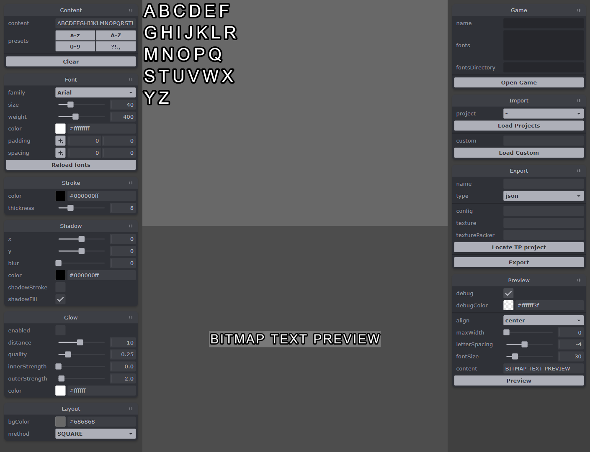

# Bitmap Font Editor

- [Origin Story](#origin-story)
- [Features](#features)
- [How to use](#how-to-use)
- [Development](#development)
- [Project structure](#project-structure)
- [NPM scripts](#npm-scripts)

## Origin story
For a long time I have been using **Littera** as a tool to create bitmap fonts. Unfortunately, it was a Flash-based tool and stopped working at December 2020. I have tried other existing editors but didn't like any of them. So I decided to create my own editor based on [Phaser](https://github.com/photonstorm/phaser) and [Tweakpane](https://github.com/cocopon/tweakpane), tools I'm very familiar with.

## Features
- automatically loads all system fonts
- text effects as shadow, glow and stroke
- export to XML or JSON
- export to Texture Packer atlas

## How to use
To start the editor run the following commands:
- `npm run ts-compile`
- `npm run serve-dev`

## Development
To start developing run the following commands:
- `npm run ts-compile`
- `npm run ts-typecheck`
- `npm run serve-dev`

Application entry point is at **src/startup/Startup.ts**

## Project structure
- **dev**  
  Development build of the game

- **scripts**  
  Cointains various helper scripts for NPM and Grunt tasks

- **src**  
  Typescript source code

## NPM scripts
- **ts-compile**  
  `cd scripts/build/ && node dev.js`  
  Compliles TS to JS using extremely fast bundler - [esbuild](https://esbuild.github.io/)

- **ts-typecheck**  
  `tsc --project ./tsconfig.json`    
  Runs typescript compiler in watch mode. As name suggests it does only typechecking without emiting any js files. On the project of this scale the full compilation (emit + typescheck) may take several seconds which is annoying. So we use combination of esbuild (emit) and typescript (typecheck) to tackles this issue.

- **ts-typecheck-fast**  
  `tsc --project ./tsconfig.fast.json`  
  The same as previous command, but it uses [the `assumeChangesOnlyAffectDirectDependencies` flag](https://github.com/microsoft/TypeScript-Website/blob/v2/packages/tsconfig-reference/copy/en/options/assumeChangesOnlyAffectDirectDependencies.md). If you work on slow low-end machine and **ts-typecheck** command takes too much time you can you this command instead but be aware of the trade-off.

- **serve-dev**  
  Serves the content of **dev** directory. We use the [**browser-sync**](https://browsersync.io/docs) package for all serving needs.

- **serve-dev-https**  
  `browser-sync start --config scripts/browser-sync/dev-https.js`    
  Serves the content of dev directory using https. You can use your custom SSL key and certificate, just add **key.pem** and **cert.pem** files to the **scripts/browser-sync/** directory. [More about this](https://browsersync.io/docs/options#option-https).

- **serve-prod**  
  `browser-sync start --config scripts/browser-sync/prod.js`    
  Serves the content of **prod** directory

- **build**  
  `grunt build`  
  Creates the production build of the game. Check [Gruntfile](Gruntfile.js) for more details.

- **deploy**  
  `grunt`    
  Creates the production build of the game and uploads it to the server.

- **texts-to-gsheet**  
  `node scripts/texts/texts-to-gsheet.js`   
  Takes the content of [dev/assets/texts.json](dev/assets/texts.json) and converts it to the Google Sheet. Check the [Localization with Google Sheets](#localization-with-google-sheets) section.

- **gsheet-to-texts**  
  `node scripts/texts/gsheet-to-texts.js && node run texts-to-ts`    
  Google Sheet to [dev/assets/texts.json](dev/assets/texts.json) conversion. Check the [Localization with Google Sheets](#localization-with-google-sheets) section.

- **config-to-ts**  
  `node scripts/config-to-ts.js`    
  Create the [typescript interface](src/IGameConfig.ts) from [dev/js/game.config.js](dev/js/game.config.js), so we will get autocomplete and typechecking.

- **texts-to-ts**  
  `json-ts ./dev/assets/texts.json --prefix 0 --rootName ILanguages --namespace texts > src/texts/ITexts.d.ts`    
  Create the [typescript interface](src/texts/ITexts.d.ts) from [dev/assets/texts.json](dev/assets/texts.json), so we will get autocomplete and typechecking.

- **polyfills**  
  `node scripts/create-polyfill-bundle.js`    
  Creates and minifies the [polyfill bundle](dev/js/polyfills.min.js). Check [create-polyfill-bundle.js](scripts/polyfills/create-bundle.mjs) for more details.

- **phaser-custom**  
  `cd scripts/phaser-custom/ && node build.js && cpy ./dist/ ../../dev/js/`    
  Creates an optimized Phaser custom build. It removes all Phaser features and classes which we don't use in the game which allow saving around 250Kb of JS code.

- **compress-graphics**  
  `grunt compress-graphics`  
  Creates AVIF, WebP and lossy PNG from the original lossless PNGs. Check [Graphics compression](#graphics-compression) section for more details.

- **compress-graphics-clear**  
  `grunt clean:compressed_graphics && grunt compress-graphics`
  Removes all compressed graphics and re-run compression from scratch
